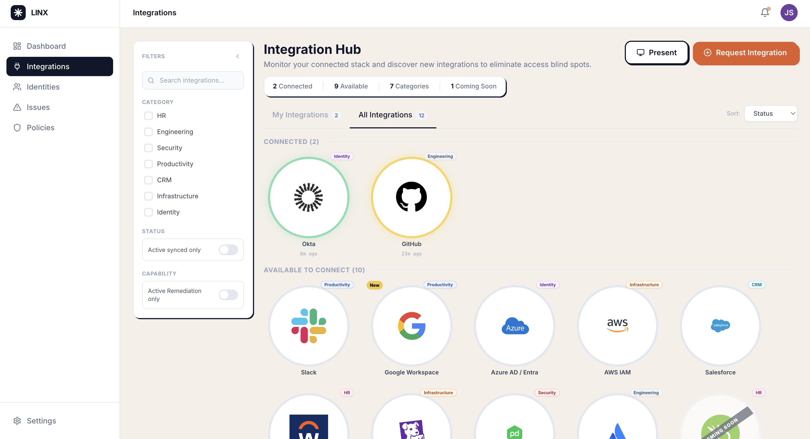
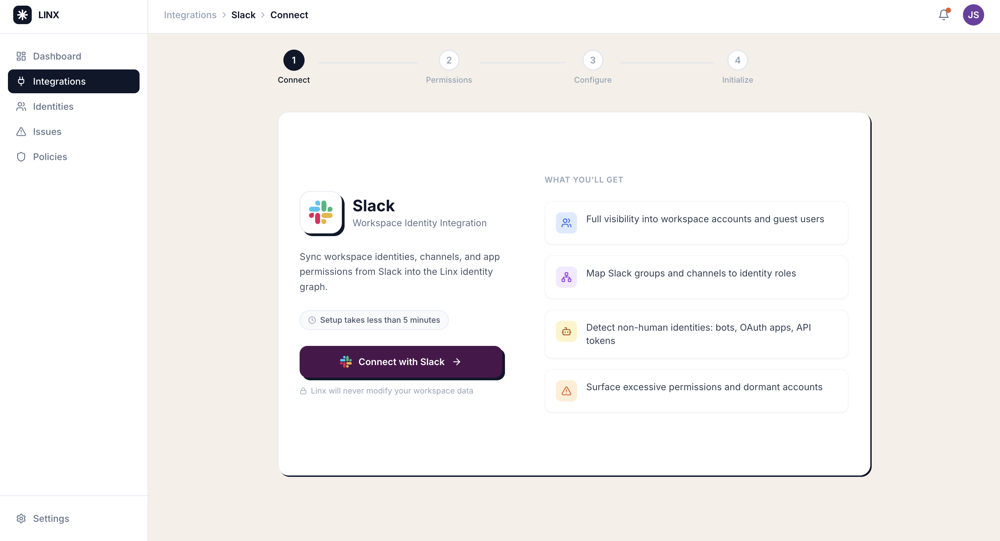
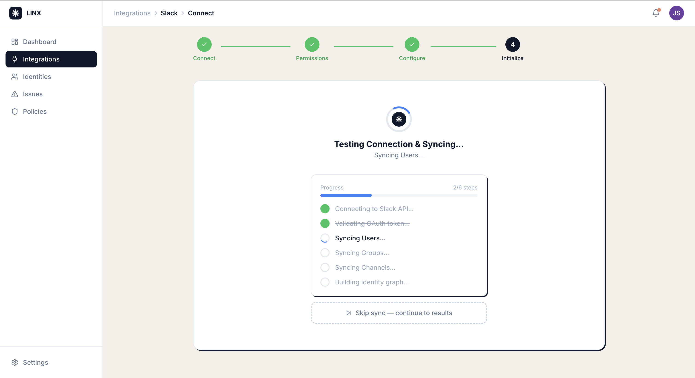
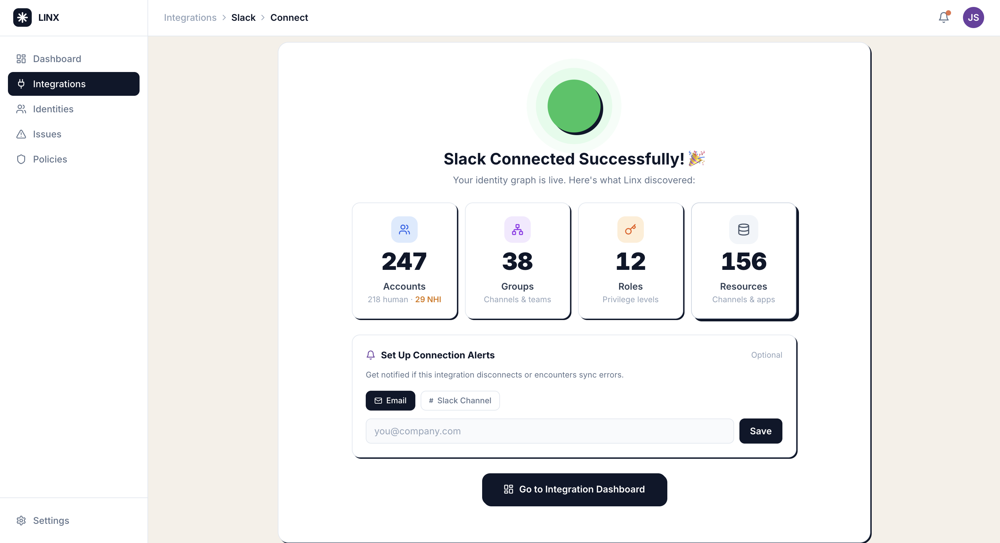
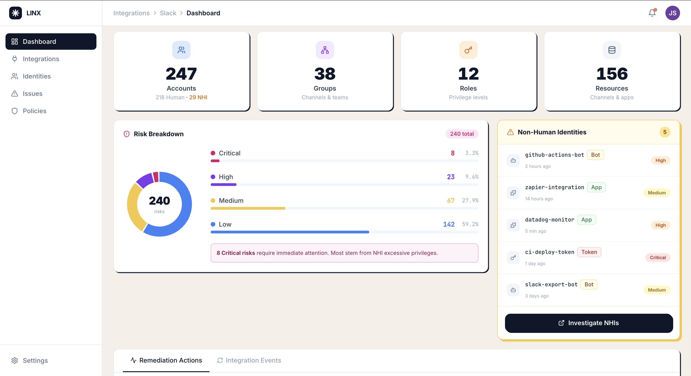

# Identity Integration Hub

> A high-fidelity product prototype for an enterprise identity security platform — built as a personal side project to explore how modern security teams could discover, audit, and remediate non-human identities across SaaS tools.


**Built by Tamir Siboni** — PM portfolio project demonstrating product vision, UX execution, and AI-accelerated development using Claude Code, sub-agents, and structured prompt engineering.

---

## What Is This?

Enterprise security teams are flying blind when it comes to **non-human identities (NHIs)** — the bots, API tokens, OAuth apps, and service accounts that proliferate silently across SaaS tools. When a developer leaves, their GitHub Actions token lives on. When a Zapier integration is abandoned, its Slack permissions remain. Manual audits can't keep up.

This prototype explores what an IAM integration platform could look like if built for the way security teams actually work: API-first, integration-heavy, and prioritizing the highest-risk identity vectors first.

| Feature | What It Does | Why It Matters |
|---|---|---|
| **Integration Catalog** | Browse and connect 12+ enterprise SaaS providers | Security teams need breadth; each integration = more risk surface covered |
| **OAuth Connection Wizard** | Guided 4-step flow with scope explanation and transparency | Reduces time-to-value; eliminates security team guesswork |
| **Entity Discovery** | Auto-discovers accounts, groups, roles, and resources post-sync | Replaces manual audits that take days |
| **NHI Detection** | Flags non-human identities by type (bots, apps, tokens) and severity | The fastest-growing attack vector in enterprise security |
| **Risk Dashboard** | Visual posture overview with donut chart and drill-down NHI list | Gives CISOs instant comprehension without reading through logs |
| **Remediation Activity Log** | Timestamped stream of resolved identity risks | Audit trail for compliance (SOC 2, ISO 27001) |

---

## Product Walkthrough

The full user journey — from discovering available integrations to an active security posture — in 5 screens.

### 1. Integration Catalog



- **My Integrations** tab shows connected systems with real-time health status badges (healthy, rate-limited, syncing, error)
- **All Integrations** surfaces 12 enterprise providers filterable by category (HR, Engineering, Security, Cloud, Identity) and remediation capability
- Stats bar aggregates entity counts across all active connections at a glance
- Search + multi-filter sidebar allows security engineers to prioritize by what matters to their stack

### 2. Connection Wizard — Value Proposition First



- Step 1 leads with **outcomes, not features** — "Detect non-human identities: bots, OAuth apps, API tokens" rather than listing OAuth scopes
- Value props are written for the person who has to justify this integration to a CISO, not just the person setting it up
- Single primary CTA eliminates decision fatigue at the most critical drop-off point in the funnel

### 3. Transparent Sync Progress



- Animated step-by-step progress indicator makes the async OAuth handshake feel controlled, not opaque
- Each sync stage is labeled in the user's mental model ("Syncing Users", "Building identity graph") — not in technical implementation terms
- Step labels correspond directly to the entity taxonomy used throughout the rest of the product

### 4. Discovery Success — Immediate Value



- The success state is designed to be the product's first "aha moment" — 247 accounts, 38 groups, 12 roles, 156 resources discovered in a single sync
- Entity count breakdown uses the same 4-entity taxonomy consistently throughout the product (accounts / groups / roles / resources)
- Alert setup is offered inline — capitalizing on the moment users are most motivated to configure notifications

### 5. Security Dashboard — Posture at a Glance



- Risk donut chart answers the CISO-level question first: "What proportion of my identity estate is at risk?"
- NHI list surfaces the highest-priority identity risk vector with individual status per entity — because remediation is per-identity, not per-cohort
- Remediation activity log provides the temporal audit trail required for compliance reporting — a different question from the chart or the list

---

## Technical Architecture

Production-quality component architecture designed for extensibility, not just demo purposes.

| Technology | Version | Role |
|---|---|---|
| React | 18 | UI rendering with concurrent mode |
| TypeScript | 5.x | Type safety across all components and data models (strict mode) |
| Vite | 5.x | Build tooling with HMR |
| Tailwind CSS | 3.x | Design token-based styling with custom shadow and color system |
| Lucide React | Latest | Consistent 400+ icon library |

**Architecture decisions:**
- **State-based routing** (no React Router) — `view` string in `App.tsx` — deliberate choice to keep the prototype self-contained and portable without framework overhead
- **Design system built from scratch** — `OffsetCard`, `StatusBadge`, `EntityBadge` components enforce visual consistency across all views
- **Data layer separated from UI** — `src/data/integrations.ts` and `src/data/mockData.ts` mock a real API contract, making a future backend swap straightforward

```
App.tsx (view state router)
├── Sidebar + TopBar (layout shell)
├── IntegrationGallery (view: 'gallery')
│   ├── FilterPanel (search + category checkboxes + toggles)
│   ├── GalleryHeader (stats bar + tabs + sort)
│   ├── IntegrationCard ×12 (3D flip card with status ring)
│   └── MissingIntegrationCard (request flow)
├── ConnectFlow (view: 'integrations') — 4-step wizard
│   ├── Step1Connect → Step2Permissions → Step3Config → Step4Initialize
└── Dashboard (view: 'dashboard')
    ├── HealthMetrics (sync status + API usage bar)
    ├── EntityCounters (accounts / groups / roles / resources)
    ├── RiskVisualization (donut chart + severity breakdown)
    ├── NHIHighlight (non-human identity list)
    └── ActivityLog (remediation actions + system logs tabs)
```

---

## Running Locally

**Requirements:** Node.js 18+

```bash
git clone https://github.com/Tamirsi7/iam-integration-hub.git
cd iam-integration-hub
npm install
npm run dev
```

No API keys or environment variables required — all data is mocked and self-contained.

---

## About This Project

This is a personal side project built to explore what a modern IAM integration platform could look like. Inspired by observing how enterprise security teams struggle to maintain visibility over non-human identities as their SaaS estate grows, I wanted to prototype the end-to-end user experience: from discovering available integrations, through a low-friction OAuth connection flow, to an actionable security dashboard.

The 5-screen user journey was story-mapped before a single line of code was written — defining the user (security engineers), the pain (invisible NHI risk), and the moment of value (seeing entity counts after first sync). All product decisions — scope, information architecture, UX hierarchy, and feature prioritization — were made through the lens of PM thinking. AI tools (specifically Claude Code with parallel sub-agents and skill invocations) served as the development accelerator.

**Go deeper:**
- [Product Brief](./PRODUCT_BRIEF.md) — Problem statement, persona, scope prioritization, success metrics
- [Design Decisions](./DESIGN_DECISIONS.md) — UX rationale and tradeoffs behind key decisions
- [AI Development Process](./AI_DEVELOPMENT_PROCESS.md) — How Claude Code + sub-agents were used as a PM development tool
- [User Story Map](./docs/USER_STORIES.md) — The story backbone that preceded all design and code

---

*Built by Tamir Siboni | [LinkedIn](https://www.linkedin.com/in/YOUR-HANDLE-HERE)*

*Open to PM roles in security, infrastructure, and developer tooling.*
